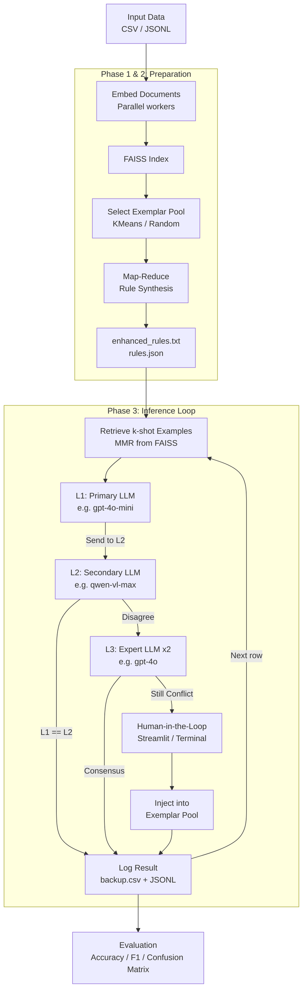

# PoliPrompt: Multimodal Agentic Framework

PoliPrompt is a Python framework for automated text and multimodal classification using a three-layer LLM inference pipeline with Human-in-the-Loop (HITL) active learning. It was originally designed for political science research and is general enough for any labeling task that benefits from few-shot learning.

## How the System Works



## Installation

Requires Python 3.10+ and [uv](https://docs.astral.sh/uv/).

```bash
# 1. Install uv (skip if already installed)
# macOS / Linux
curl -LsSf https://astral.sh/uv/install.sh | sh

# Windows (PowerShell)
powershell -ExecutionPolicy ByPass -c "irm https://astral.sh/uv/install.ps1 | iex"

# 2. Clone the repository
git clone https://anonymous.4open.science/r/PoliPrompt-Refactor-848E.git
cd PoliPrompt-Refactor

# 3. Install dependencies — choose what you need:
uv sync --extra openai        # OpenAI (GPT-4o, embeddings)
uv sync --extra qwen          # Alibaba / Qwen (multimodal embeddings)
uv sync --extra google        # Google Gemini
uv sync --extra anthropic     # Anthropic / Claude
uv sync --extra all           # All providers + Streamlit UI + observability
```

## API Keys

Obtain API keys from your provider before running:

| Provider | Environment Variable | Where to Get |
|---|---|---|
| OpenAI | `OPENAI_API_KEY` | https://platform.openai.com/api-keys |
| Alibaba / Qwen | `DASHSCOPE_API_KEY` | https://dashscope.console.aliyun.com/ |
| Google | `GOOGLE_API_KEY` | https://aistudio.google.com/apikey |
| Anthropic | `ANTHROPIC_API_KEY` | https://console.anthropic.com/ |

## Streamlit UI

The easiest way to run PoliPrompt — no coding required.

> Requires `uv sync --extra all`

```bash
uv run streamlit run streamlit_app.py
```

**Steps in the UI:**
1. Enter your API keys in the sidebar → click **Save Credentials to .env**
2. Fill in project settings (dataset path, label options, models)
3. Run in order: **Build Pool → Optimise Rules → Annotate**
4. Click **Run Evaluation** to view accuracy, F1, and confusion matrix

### Quick Demo with Included Datasets

Two example datasets are included under `examples/`:

**Multimodal — Hateful Memes detection (0 = not hateful, 1 = hateful):**
- `work_station`: absolute path to `examples/HatefulMemes-tiny`
- `modality`: `multimodal`
- `data_path`: `train-tiny.jsonl`
- `image_dir`: `.` *(the JSONL file already contains the subfolder prefix `img/`, so set this to `.` to use `work_station` as the image root)*
- `options`: `0, 1`

**`prompt.txt` content (copy and paste):**

```text
You are a Senior Content Moderator. Your task is to classify memes 
based on the official Hateful Memes Challenge definition.

# CORE DEFINITIONS
- HATEFUL (label: 1): A direct or indirect attack on people based on
protected characteristics (race, religion, ethnicity, nationality, 
immigration status, sex, gender identity, sexual orientation, or disability).
- NOT HATEFUL (label: 0): Content that lacks a clear attack on a protected group.

# FORMAT REQUIREMENT
You MUST return your response as a JSON object with exactly two fields:
1. "label": "0" for not hateful, "1" for hateful.
2. "reason": A one-sentence explanation.
Return ONLY the JSON.
```

**Text — BBC News topic classification:**
- `work_station`: absolute path to `examples/BBCNews-tiny`
- `modality`: `text`
- `data_path`: `BBCNews-tiny.csv`
- `options`: `politics, business, sport, technology, entertainment`

**`prompt.txt` content (copy and paste):**

```text
You are a News Reporter. Your task is to classify news text into one of these categories: "politics", "business", "sport", "technology", or "entertainment".

# INSTRUCTION
Analyze the text briefly and determine the most appropriate category. 

# FORMAT REQUIREMENT
You MUST return your response as a JSON object with exactly two fields:
1. "label": The selected category name.
2. "reason": A one-sentence explanation of why this category fits.

Return ONLY the JSON.
```

## Python API

For developers and researchers who prefer code:

```python
from poliprompt import TextClassifier, MultiModalClassifier

clf = TextClassifier(
    config_path="path/to/config.yaml",
    prompt_path="path/to/prompt.txt",
)

clf.create_few_shot_pool()       # Phase 1: embed + select exemplars
clf.optimize_task_description()  # Phase 2: extract reasoning rules
clf.annotate()                   # Phase 3: classify all rows

metrics = clf.evaluate()
print(f"Accuracy: {metrics['accuracy']:.3f}")
```

A complete end-to-end example (both text and multimodal) is available in
`notebooks/TopicExperiment.ipynb`. Select the `.venv` kernel and run all cells.

## Documentation

| Section | Contents |
|---|---|
| Getting Started | What PoliPrompt is and when to use it |
| Quick Start | Step-by-step installation and first run |
| API Reference | Public methods of TextClassifier and MultiModalClassifier |
| Configuration | All config.yaml fields explained |
| Architecture | Inference pipeline and component design |
| Changelog | Version history |


