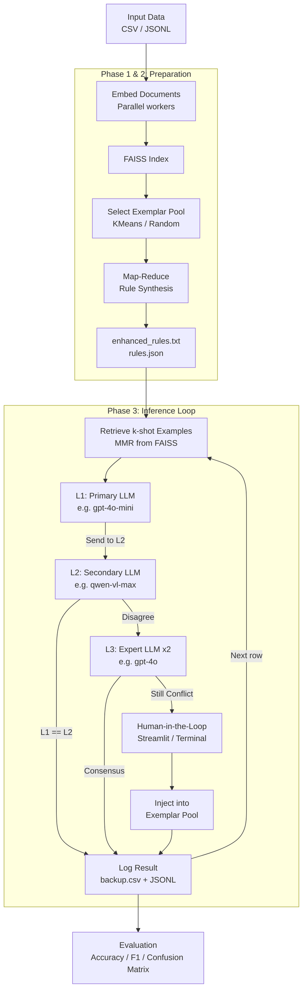

<p align="center">
  
</p>

---

[](https://pypi.org/project/PoliPrompt/)
[](https://github.com/geshijoker/PoliPrompt/actions)
[](https://poliprompt-tutorial.readthedocs.io/en/latest/)
[](https://pypi.org/project/poliprompt/)
[](https://github.com/geshijoker/PoliPrompt/blob/main/LICENSE)
[](https://arxiv.org/pdf/2409.01466)

# PoliPrompt: Multimodal Agentic Framework

PoliPrompt is a Python framework for automated text and multimodal classification using a three-layer LLM inference pipeline with Human-in-the-Loop (HITL) active learning. It was originally designed for political science research and is general enough for any labeling task that benefits from few-shot learning.

## How the System Works



## Installation

Requires [uv](https://docs.astral.sh/uv/) and Python 3.10+.

```bash
git clone https://github.com/geshijoker/PoliPrompt.git
cd PoliPrompt
uv sync                       # core dependencies only
```

Install the LLM provider you need:

```bash
uv sync --extra openai        # OpenAI (GPT-4o, embeddings)
uv sync --extra qwen          # Alibaba / Qwen (multimodal embeddings)
uv sync --extra google        # Google Gemini
uv sync --extra anthropic     # Anthropic (Claude)
uv sync --extra all           # all providers + Streamlit UI + observability
```

## Streamlit UI

A no-code interface for configuring and running the full pipeline:

```bash
uv sync --extra all
streamlit run streamlit_app.py
```

The sidebar has one expander per LLM role (**Embedding**, **Primary L1**, **Secondary L2**, **Expert L3**). For each role, select a provider (OpenAI, Anthropic, Google, Qwen), pick a model from the dropdown, and enter your API key and optional base URL. Click **Save Credentials to .env** to persist them locally.

In the main panel, fill in project settings, column mapping, and inference hyperparameters, then click **Save Config & Initialise Classifier**. Run the three pipeline phases in order — live logs stream as each phase executes. When models disagree, a Human-in-the-Loop card appears inline for manual labeling.

---

## Documentation

| Section | Contents |
|---|---|
| [Getting Started](./docs/getting-started/introduction.md) | What PoliPrompt is and how to run your first classification |
| [API](./docs/api/reference.md) | Public methods of `TextClassifier` and `MultiModalClassifier` |
| [Concepts](./docs/concepts/architecture.md) | Inference pipeline, LangGraph state machine, and component design |
| [Configuration](./docs/configuration/configuration.md) | All `config.yaml` fields explained |
| [About](./docs/about/about-us.md) | Project background, changelog, and roadmap |

## Citation

To cite the [PoliPrompt](https://arxiv.org/abs/2409.01466) paper:

```bibtex
@article{liu2024poliprompt,
  title={PoliPrompt: A High-Performance Cost-Effective LLM-Based Text Classification Framework for Political Science},
  author={Liu, Menglin and Shi, Ge},
  journal={arXiv preprint arXiv:2409.01466},
  year={2024}
}
```
